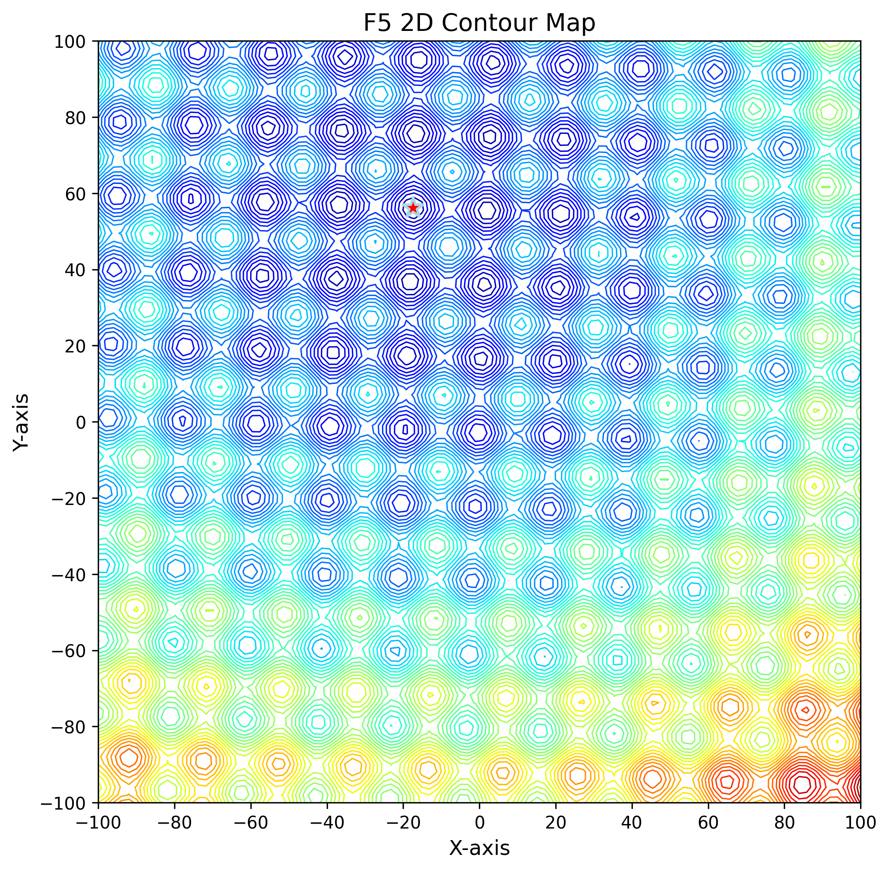

<div align="center">
  <h1>Unified CEC2013 & CEC2017 Benchmark Suite</h1>
  <p><b>A Research-Grade Implementation of 57 Metaheuristic Optimization Functions</b></p>

  [](https://www.python.org/downloads/)
  [](#)
  [](https://opensource.org/licenses/MIT)

</div>

---

## 📖 Abstract

This repository provides a highly-optimized, mathematically rigorous Python implementation of the **CEC2013** and **CEC2017** Benchmark Suites for Single-Objective Real-Parameter Numerical Optimization. 

Designed for researchers and practitioners, this framework abandons black-box dependencies in favor of **1-to-1 mathematical parity** with the original competition C source codes. It comes pre-packaged with four state-of-the-art parameter-less metaheuristics (**Rao-1, Rao-2, Rao-3, and FISA**) and features heavily accelerated multiprocessing execution.

<div align="center">
  
  
  
  <p><i>Left: 3D Surface. Middle: 2D Contour Map. Right: Algorithm Convergence Tracking.</i></p>
</div>

---

## ✨ Key Features

- **Pristine Mathematical Fidelity**: Shift vectors ($O_s$) and orthogonal rotation matrices ($M$) are rigorously audited against the official Suganthan `test_func.cpp` files to guarantee competition-standard validation.
- **High-Performance Execution**: Bypasses Python's GIL utilizing `ProcessPoolExecutor` for hardware-accelerated batch testing (e.g., executing 30 independent runs of $2.5 \times 10^5$ FES in seconds).
- **Automated Visualization**: Built-in 2D topological contours, 3D surface mapping, and iteration-by-iteration convergence plotting.
- **Robust IO**: Automated summary CSV generation, graceful error handling for locked files, and cached matrix-loading (`@lru_cache`).

---

## 🧠 Algorithms Implemented

| Algorithm | Description | Characteristic |
|-----------|-------------|----------------|
| **Rao-1** | Best–worst directional perturbation | Highly exploitative |
| **Rao-2** | Rao-1 + random partner interaction term | Balanced exploration |
| **Rao-3** | Rao-2 + second random partner interaction term | Highly explorative |
| **FISA**  | Fitness-based Individual-Step Algorithm | Parameter-free adaptability |

---

## 📊 Benchmark Functions Overview (CEC2013)

> **Note:** The column $f_i^*$ lists the **global optimum value** for each function. Search range: $[-100,100]^D$.

| No. | Functions | $f_i^*$ | Characteristics |
|------|-----------|---------|-----------------|
| 1 | Sphere Function | -1400 | Unimodal, separable |
| 2 | Rotated High Conditioned Elliptic Function | -1300 | Unimodal, non-separable, ill-conditioned, smooth irregularities |
| 3 | Rotated Bent Cigar Function | -1200 | Unimodal, non-separable, narrow ridge, high condition number |
| 4 | Rotated Discus Function | -1100 | Unimodal, non-separable, asymmetrical, one sensitive direction |
| 5 | Different Powers Function | -1000 | Unimodal, separable, variable sensitivities |
| 6 | Rotated Rosenbrock's Function | -900 | Multimodal (for $D > 3$), non-separable, narrow curved valley |
| 7 | Rotated Schaffers F7 Function | -800 | Multimodal, non-separable, asymmetrical, huge number of local optima |
| 8 | Rotated Ackley's Function | -700 | Multimodal, non-separable, asymmetrical |
| 9 | Rotated Weierstrass Function | -600 | Multimodal, non-separable, continuous but differentiable only on a set |
| 10 | Rotated Griewank's Function | -500 | Multimodal, non-separable |
| 11 | Rastrigin's Function | -400 | Multimodal, **separable**, asymmetrical, huge local optima |
| 12 | Rotated Rastrigin's Function | -300 | Multimodal, non-separable, asymmetrical, huge local optima |
| 13 | Non-Continuous Rotated Rastrigin's Function | -200 | Multimodal, non-separable, discontinuous, huge local optima |
| 14 | Schwefel's Function | -100 | Multimodal, non-separable, deceptive, second optimum far from global |
| 15 | Rotated Schwefel's Function | 100 | Multimodal, non-separable, deceptive, second optimum far |
| 16 | Rotated Katsuura Function | 200 | Multimodal, non-separable, continuous but nowhere differentiable |
| 17 | Lunacek Bi_Rastrigin Function | 300 | Multimodal, non-separable, two different basins |
| 18 | Rotated Lunacek Bi_Rastrigin Function | 400 | Multimodal, non-separable, two different basins |
| 19 | Expanded Griewank's plus Rosenbrock's Function | 500 | Multimodal, non-separable |
| 20 | Expanded Scaff's F6 Function | 600 | Multimodal, non-separable, asymmetrical |
| 21 | Composition Function (n=5, Rotated) | 700 | Multimodal, non-separable, asymmetrical, different properties around different local optima |
| 22 | Composition Function (n=3, Unrotated) | 800 | Multimodal, separable, asymmetrical, different properties around different local optima |
| 23 | Composition Function (n=3, Rotated) | 900 | Multimodal, non-separable, asymmetrical, different properties around different local optima |
| 24 | Composition Function (n=3, Rotated) | 1000 | Same as above |
| 25 | Composition Function (n=3, Rotated) | 1100 | Same as above |
| 26 | Composition Function (n=5, Rotated) | 1200 | Same as above |
| 27 | Composition Function (n=5, Rotated) | 1300 | Same as above |
| 28 | Composition Function (n=5, Rotated) | 1400 | Same as above |

---

## 📊 Benchmark Functions Overview (CEC2017)

> **Note:** The column $F_i^*$ lists the **global optimum value** for each function. Search range: $[-100,100]^D$. Function F2 is excluded per official CEC2017 errata.

| No. | Functions | $F_i^*$ | Properties |
|------|-----------|---------|-------------|
| 1 | Shifted and Rotated Bent Cigar Function | 100 | Unimodal, non-separable, smooth but narrow ridge |
| 2 | Shifted and Rotated Zakharov Function | 200 | Unimodal, non-separable |
| 3 | Shifted and Rotated Rosenbrock's Function | 300 | Multimodal, non-separable, narrow curved valley |
| 4 | Shifted and Rotated Rastrigin's Function | 400 | Multimodal, non-separable, huge number of local optima, second best local optimum far from global |
| 5 | Shifted and Rotated Expanded Scaffer's F6 Function | 500 | Multimodal, non-separable, asymmetrical, huge number of local optima |
| 6 | Shifted and Rotated Lunacek Bi_Rastrigin Function | 600 | Multimodal, non-separable, asymmetrical, continuous everywhere but differentiable nowhere |
| 7 | Shifted and Rotated Non-Continuous Rastrigin's Function | 700 | Multimodal, non-separable, asymmetrical, huge number of local optima |
| 8 | Shifted and Rotated Levy Function | 800 | Multimodal, non-separable, huge number of local optima |
| 9 | Shifted and Rotated Schwefel's Function | 900 | Multimodal, non-separable, huge number of local optima, second best local optimum far from global |
| 10 | Hybrid Function 1 (N = 3) | 1000 | Hybrid: multi-modal or unimodal depending on subcomponents, non-separable subcomponents, different properties per variable subset |
| 11 | Hybrid Function 2 (N = 3) | 1100 | Same as above |
| 12 | Hybrid Function 3 (N = 3) | 1200 | Same as above |
| 13 | Hybrid Function 4 (N = 4) | 1300 | Same as above |
| 14 | Hybrid Function 5 (N = 4) | 1400 | Same as above |
| 15 | Hybrid Function 6 (N = 4) | 1500 | Same as above |
| 16 | Hybrid Function 7 (N = 5) | 1600 | Same as above |
| 17 | Hybrid Function 8 (N = 5) | 1700 | Same as above |
| 18 | Hybrid Function 9 (N = 5) | 1800 | Same as above |
| 19 | Hybrid Function 10 (N = 6) | 1900 | Same as above |
| 20 | Composition Function 1 (N = 3) | 2000 | Composition: multi-modal, non-separable, asymmetrical, different properties around different local optima |
| 21 | Composition Function 2 (N = 3) | 2100 | Same as above |
| 22 | Composition Function 3 (N = 4) | 2200 | Same as above |
| 23 | Composition Function 4 (N = 4) | 2300 | Same as above |
| 24 | Composition Function 5 (N = 5) | 2400 | Same as above |
| 25 | Composition Function 6 (N = 5) | 2500 | Same as above |
| 26 | Composition Function 7 (N = 6) | 2600 | Same as above |
| 27 | Composition Function 8 (N = 6) | 2700 | Same as above |
| 28 | Composition Function 9 (N = 3) | 2800 | Composition using hybrid functions: multi-modal, non-separable, asymmetrical, different properties for different variable subcomponents |
| 29 | Composition Function 10 (N = 3) | 2900 | Same as above |

---

## 🚀 Quick Start

The framework is strictly script-based, keeping the workspace transparent and free of heavy Python package clutter.

### 1. Clone the Repository
```bash
git clone https://github.com/LakshyMaheshwari/CEC13-CEC17.git
cd CEC13-CEC17
```

### 2. Install Requirements
```bash
pip install -r requirements.txt
```

### 3. Run Interactive Mode
Launch the interactive CLI to choose your algorithm and function visually:
```bash
# For CEC2013:
python -m CEC2013.main

# For CEC2017:
python -m CEC2017.main
```

### 4. Batch Automation (Run All)
Run all algorithms across all functions and dimensions:
```bash
python -m CEC2017.main --all --func 1
python -m CEC2013.main --all --func 1
```

### 5. CLI Options
```
usage: main.py [-h] [--algo {rao1,rao2,rao3,fisa}] [--func FUNC_ID]
               [--all] [--no-plots] [--resume]
               [--runs RUNS] [--max-fes MAX_FES] [--pop-size POP_SIZE]

Options:
  --algo ALGO       Algorithm to run (rao1, rao2, rao3, fisa)
  --func FUNC_ID    Function ID (1-30 for CEC2017, 1-28 for CEC2013)
  --all             Run all algorithms sequentially
  --no-plots        Skip visualization generation
  --resume          Skip already-computed results
  --runs N          Number of independent runs (default: 30)
  --max-fes N       Max function evaluations per run (default: 100000)
  --pop-size N      Population size (default: 50)
```

---

## 📂 Architecture

```text
CEC13-CEC17/
├── CEC2013/
│   ├── algorithms/          # Rao-1, Rao-2, Rao-3 & FISA implementations
│   ├── functions/           # CEC2013 F1-F28, shift/rotation data files
│   │   └── cec2013/data/    # Official M_D*.txt and shift_data.txt
│   ├── utils/               # Bounds handling, population init, raw data export
│   ├── visualization/       # Convergence, 3D surface, 2D contour plotters
│   ├── main.py              # Interactive CLI & batch entry point
│   ├── runner.py            # Experiment orchestrator (parallel runs)
│   ├── results.py           # Result file I/O
│   ├── config.py            # Hyperparameters (POP_SIZE, MAX_FES, etc.)
│   ├── summarize.py         # Summary CSV builder
│   └── collect_results.py   # Post-hoc result aggregation utility
├── CEC2017/
│   └── (Mirrored architecture for CEC2017 F1, F3-F30)
├── tests/
│   ├── test_algorithms.py
│   └── test_all_comprehensive.py  # 67-test CI validation suite
├── assets/                  # README images
├── requirements.txt
├── LICENSE
└── README.md
```

---

## 📈 Output Structure

All execution metrics are automatically structured into publishable formats within the `results/` directory:

```
results/
├── rao2/
│   ├── F1/
│   │   ├── rao2_F1_D10.txt            # Summary statistics
│   │   ├── rao2_F1_D10_solution.txt   # Final optimal vector
│   │   ├── rao2_convergence_D2.png    # Convergence plot
│   │   └── rao2_F1_3D.png            # 3D surface visualization
│   ├── summary_rao2_D2.csv            # Per-algorithm analytical stats
│   └── rao2_raw_runs.csv              # Individual run data (Wilcoxon-ready)
└── comparison_summary.csv             # Cross-algorithm comparison data
```

---

## 🤝 Contributing

Contributions to expand the suite (e.g., CEC2022) or add new metaheuristics (e.g., DE, PSO) are highly encouraged!

1. Fork the repository
2. Create your feature branch (`git checkout -b feature/NewAlgorithm`)
3. Ensure the test suite passes (`pytest tests/`)
4. Commit your changes (`git commit -m 'Add New Algorithm'`)
5. Push and open a Pull Request

---

## 📚 References

- J. J. Liang, B. Y. Qu, P. N. Suganthan, A. G. Hernández-Díaz, "Problem Definitions and Evaluation Criteria for the CEC 2013 Special Session on Real-Parameter Optimization," *Nanyang Technological University*, 2013.
- N. H. Awad, M. Z. Ali, J. J. Liang, B. Y. Qu, P. N. Suganthan, "Problem Definitions and Evaluation Criteria for the CEC 2017 Special Session and Competition on Single Objective Bound Constrained Real-Parameter Numerical Optimization," *Nanyang Technological University*, 2016.
- R. V. Rao, "Jaya: A simple and new optimization algorithm for solving constrained and unconstrained optimization problems," *International Journal of Industrial Engineering Computations*, 7(1), 19–34, 2016.

---

## 📜 Citation

If you utilize this framework in your academic research or papers, please cite:

```bibtex
@software{cec_benchmark_rao,
  author = {Lakshya Maheshwari},
  title = {Unified CEC2013 \& CEC2017 Benchmark Optimization Suite},
  url = {https://github.com/LakshyMaheshwari/CEC13-CEC17},
  year = {2024},
  note = {Features mathematically verified 1-to-1 C parity.}
}
```